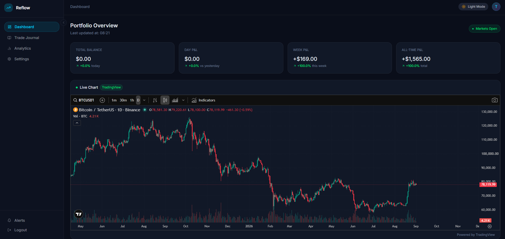
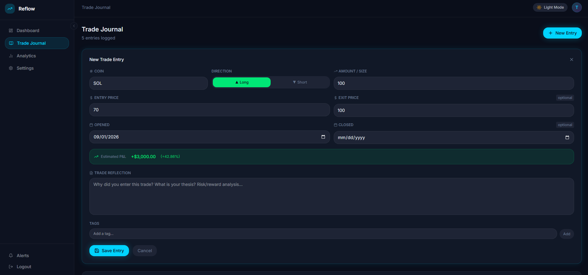
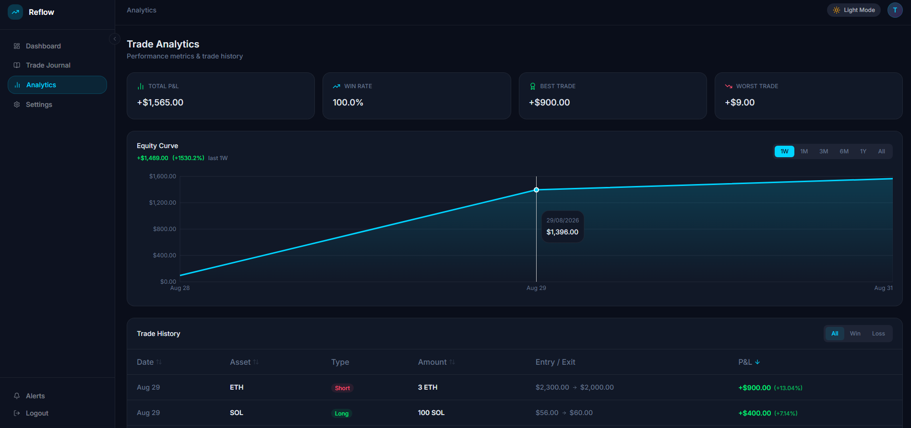
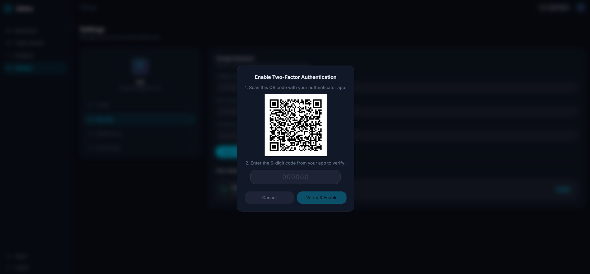
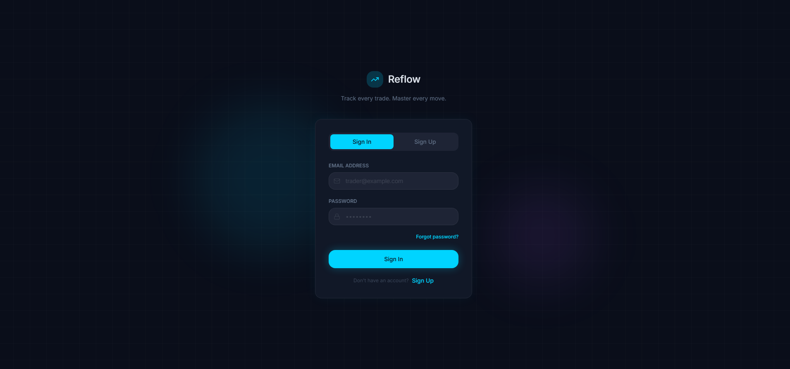
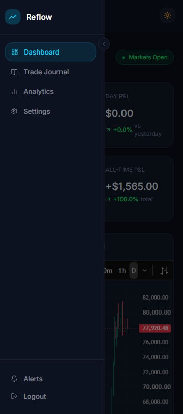

# Reflow

A full-stack crypto trading journal with real-time market data, portfolio analytics, and production-grade authentication security.

**Live demo:** [reflow-bice.vercel.app](https://reflow-bice.vercel.app/)
**Repo:** [github.com/Koraxdd/Reflow](https://github.com/Koraxdd/Reflow)

> Try it instantly with the **Demo Login** button on the landing page — no signup required.

---

## TL;DR

Reflow lets traders log crypto trades, track live prices via WebSocket, and analyse performance through an equity curve, win-rate stats, and portfolio allocation charts. Auth is built from scratch with NextAuth, including email verification (Resend), TOTP two-factor authentication (QR-code enrollment), and rate limiting on sensitive endpoints (Upstash Redis).

**Core stack:** Next.js (App Router) · TypeScript · Prisma · PostgreSQL (Neon) · TanStack Query · Tailwind CSS · Recharts · Motion

**Highlights:**

- Live price data via native WebSocket connections to Binance's public market stream
- Email verification, TOTP 2FA with QR enrollment, and Redis-backed rate limiting
- Paginated, filterable, sortable trade history + equity curve and allocation charts
- TanStack Query throughout, including hand-rolled optimistic updates with rollback
- Real dark/light theme switching, currency-aware formatting (live FX rates via Frankfurter)

---

## Features

### Trade Journal

Full CRUD for trade entries — symbol, direction (long/short), entry/exit price, quantity, open/close dates, tags, and free-text reflections. Paginated and backed entirely by server-side Prisma queries.

### Dashboard

- Portfolio stat cards (current balance, day/week/all-time realized P&L) computed from trade data and live prices
- Embedded TradingView advanced chart widget
- Intraday price chart (4h increments) per watchlisted asset
- Portfolio allocation donut chart, valued in real-time via live prices
- Watchlist with live price, 24h change, and volume via a Binance WebSocket combined stream

### Analytics

- Win rate, best/worst trade, realized P&L breakdowns
- Equity curve with selectable timeframes (1W / 1M / 3M / 6M / 1Y / All)
- Trade history table with win/loss filtering, multi-field sorting, and pagination

### Settings

- Profile management (username, timezone, base currency) with **safe email-change flow** — new address is held as `pendingEmail` and only promoted after re-verification, so a mistyped email can never lock a user out of their account
- Password change with current-password confirmation
- **Two-factor authentication** — TOTP enrollment with QR code, confirmation-before-enable, password-gated disable
- Notification preferences and appearance settings (dark/light theme is fully wired via `next-themes`, along with few preferences like compact view and default chart type)

### Alerts

In-app notification sidebar with read/unread state, mark-all-read, and optimistic updates. Currently wired to trade-execution events; price alerts, daily summaries, and email digests are scaffolded in Settings but not yet triggered (see [Known Limitations](#known-limitations)).

---

## Tech Stack

| Layer            | Choice                                                                           |
| ---------------- | -------------------------------------------------------------------------------- |
| Framework        | Next.js 15 (App Router, Server Components + Server Actions)                      |
| Language         | TypeScript                                                                       |
| Database         | PostgreSQL (Neon), Prisma ORM                                                    |
| Auth             | NextAuth (Credentials provider), Argon2 password hashing                         |
| 2FA              | otplib (TOTP) + qrcode                                                           |
| Email            | Resend                                                                           |
| Rate limiting    | Upstash Redis + `@upstash/ratelimit`                                             |
| Server state     | TanStack Query (React Query)                                                     |
| Forms/validation | React Hook Form + Zod                                                            |
| Styling          | Tailwind CSS                                                                     |
| Charts           | Recharts, TradingView widget                                                     |
| Animation        | Motion                                                                           |
| Live market data | Binance public WebSocket streams; Binance REST for historical & snapshot pricing |
| Deployment       | Vercel                                                                           |

---

## Getting Started

### Prerequisites

- Node.js 18+
- A PostgreSQL database (this project uses [Neon](https://neon.tech))
- API keys: [Resend](https://resend.com), [Upstash Redis](https://upstash.com)

### Setup

```bash
git clone https://github.com/Koraxdd/Reflow.git
cd Reflow
npm install
```

Create a `.env.local` file:

```env
DATABASE_URL=
NEXTAUTH_SECRET=
RESEND_API_KEY=
UPSTASH_REDIS_REST_URL=
UPSTASH_REDIS_REST_TOKEN=
NEXT_PUBLIC_APP_URL=http://localhost:3000
```

Run migrations and start the dev server:

```bash
npx prisma migrate dev
npm run dev
```

---

## Architecture Notes & Decisions

A few choices worth calling out, since they came from real tradeoffs rather than defaults:

- **WebSocket vs. REST for pricing:** the watchlist uses a live Binance WebSocket stream (genuinely real-time, sub-second). Total Balance and Portfolio Allocation initially reused the same WebSocket, but concurrent connections caused visible animation jank — these were refactored to poll Binance's REST endpoint on an interval instead, since neither actually needs sub-second freshness. This mirrors how production portfolio trackers separate live _market_ data from periodic _portfolio summary_ data.
- **Win/loss filtering & sorting on Trade History:** P&L isn't a stored column by default — it's derived from `entryPrice`, `exitPrice`, `direction`, and `quantity`. Filtering/sorting by it required either raw SQL or a denormalized `pnlAmount` column; a stored, derived column was chosen for correctness and to keep pagination fully database-driven.
- **Email-change safety:** rather than overwriting `email` immediately (which would force sign-out and risk permanent lockout on a typo), a new email is staged as `pendingEmail` and only promoted after the verification link is clicked. The user's session and login remain fully functional on the old, verified address the entire time.
- **Currency conversion is display-only:** base currency preference converts portfolio-level figures (balance, P&L) using live FX rates, but never touches asset prices themselves (watchlist, charts) — those stay USD, matching how crypto is quoted everywhere in practice.

## Known Limitations

- **Email delivery** is sandboxed to my own address (Resend's free tier requires a verified custom domain to send to arbitrary recipients) — the demo account exists specifically so this doesn't block anyone from trying the app.
- **Price alerts, daily portfolio summaries, and crypto news digests** are present as notification-preference toggles but don't yet trigger — they require scheduled background jobs, which weren't in scope for this pass.

---

## Screenshots

**Dashboard**

<p align="center">  </p>

**Trade Journal**

<p align="center">  </p>

**Analytics**

<p align="center">  </p>

**2FA**

<p align="center">  </p>

**Landing Page**

<p align="center">  </p>

**Mobile**

<p align="center">  </p>
